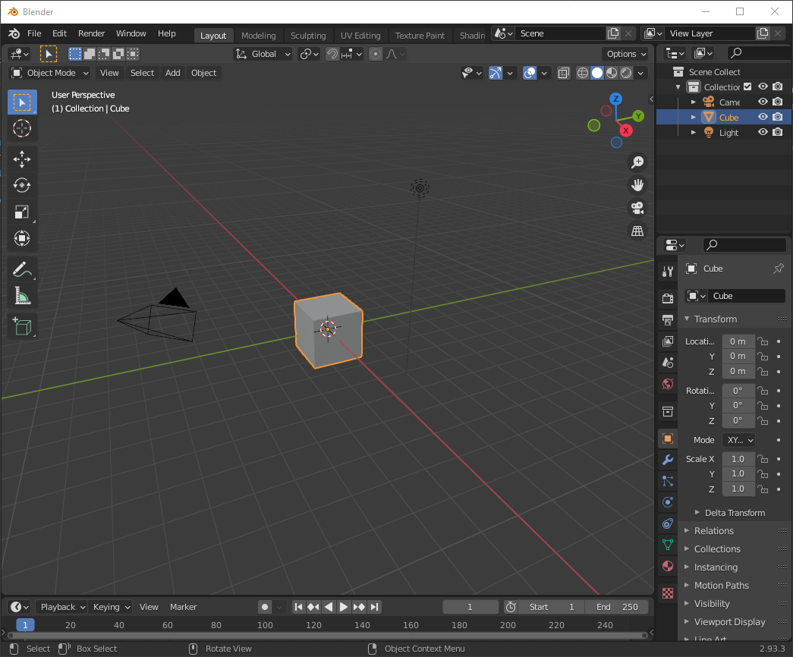

# FFXI line-of-sight meshes

This repository contains triangle meshes for each zone in the FFXI world, which describe the solid objects in each zone that can not be seen through by players or NPCs.

The `current` branch in this repository contains files for all current retail zones, and this is the main branch that should be made PRs onto. There will also be other branches covering various previous eras, which will just contain the zones that are relevant for that era.

These files are based on the collision meshes from the game itself, and as such may contain barriers and other artifacts that should not come into play with regards to checking line-of-sight checks, see [preprocessing](#preprocessing) for more details. Some zones may therefore require manual editing to remove these extra collision artifacts from the mesh. See [editing](#editing) on how to do this.

## Editing in Blender

[Blender](https://www.blender.org/download/) is an excellent and free tool for editing these meshes, and will be the tool used to explain editing the files here.

### Start blender
When first opening Blender, it will contain som intial objects. Clean up the scene by removing all of these (camera, cube, light) by pressing <kbd>Delete</kbd> on each of them.

### Import a zone OBJ file
Import the specific OBJ file for the zone you want to edit:

### Navigating Blender
Press <kbd>Shift</kbd> + <kbd>`</kbd> to enter "walk navigation". You can see how to move around in this navigation mode in the bottom status bar. It is basically mouse and WASD, and you can modify your speed with the scroll wheel and <kbd>Shift</kbd>.

### Edit mode
Press <kbd>Tab</kbd> to enter "Edit Mode". Your current mode can be seen in the top left corner. In this mode you can select and edit or delete vertices, edges, and/or faces (surfaces).

### Selection and deletion
To be able to select surfaces/faces specifically, click the option to do so:

You can now select the faces in the scene by clicking on them, using <kbd>Shift</kbd> to add to your selection.
Additionally, Blender has a bunch of automatic selection features, that can possibly help select the desired faces for you, such as selecting all linked faces to your current selection (shortcut <kbd>Ctrl</kbd> + <kbd>L</kbd>).

After having selected the faces you want to remove, press <kbd>Delete</kbd> and then select **Faces** to delete them along with their vertices and edges.

### Exporting
After having performed the changes you want to do, you can export the mesh into the same file as it was loaded from. While exporting be sure to have the following options unchecked/checked in the *Geometry* submenu. Namely only "Triangulate Faces" and "Keep Vertex Order" should be checked, and none of the others in that section:

### Committing
Commit your changes to your local git repository, push the branch, and make a GitHub PR for it. Ideally you include one or more images showing what changes you have made in the zones, since it is not really possible from just looking at the PR changes themselves.

## Preprocessing

The original collision meshes have been preprocessed to reduce the amount of triangles in the mesh by using Blender along with the `process_obj.py` script in this repository. This is done because the collision meshes are massive in size, and contains a lot of detail that isn't necessary when trying just to determine if a sight-line is obstructed or not.

The reduction in the amount of triangles also greatly reduces the memory footprint and time it takes when a program does ray-intersection checks on the model.
